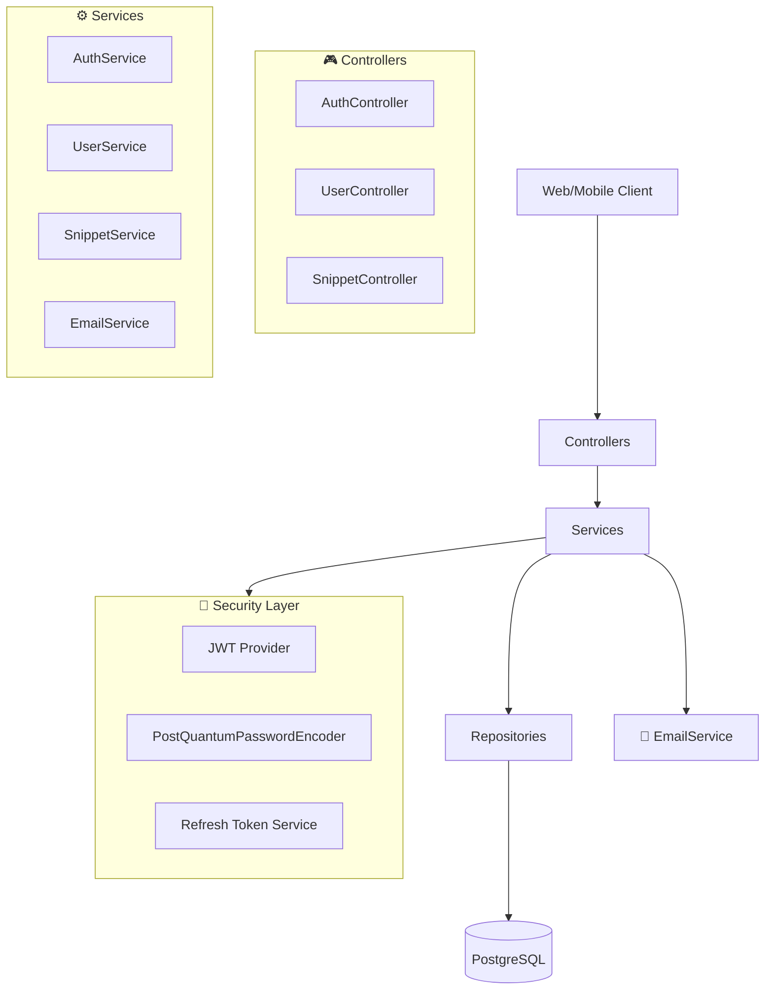
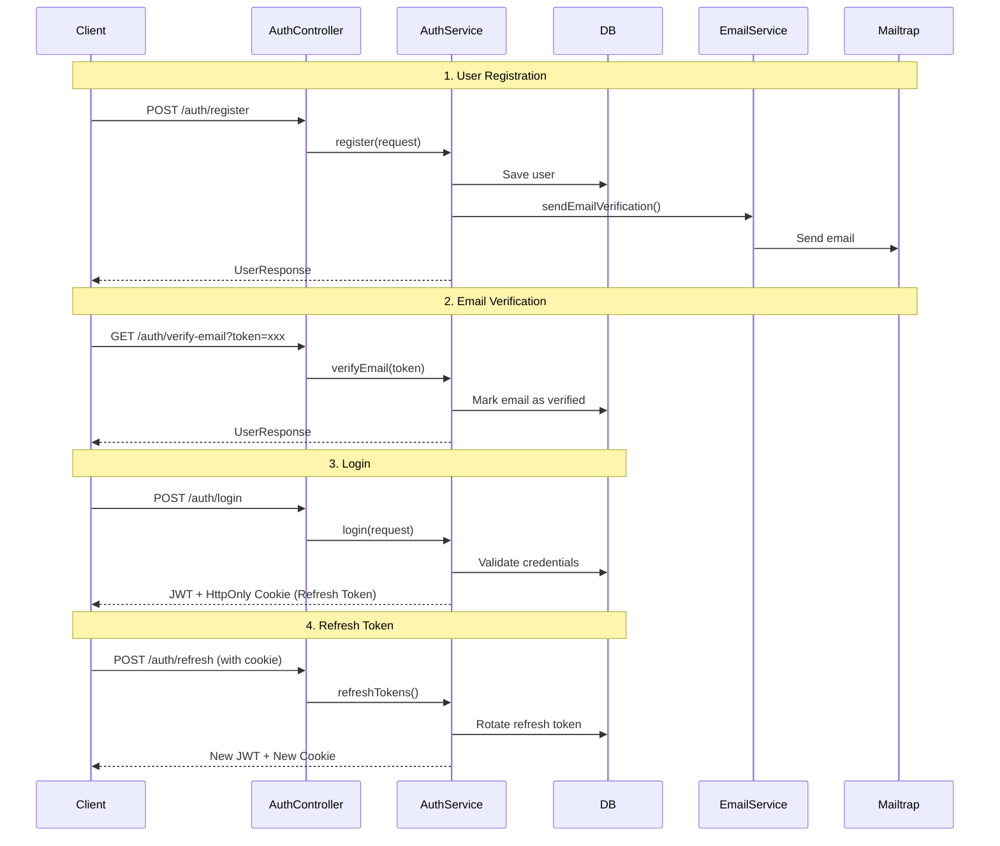
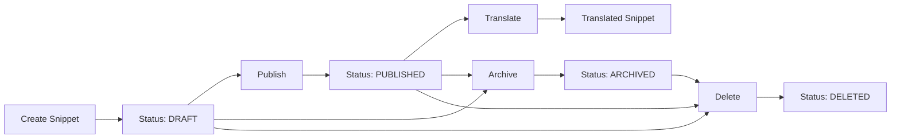
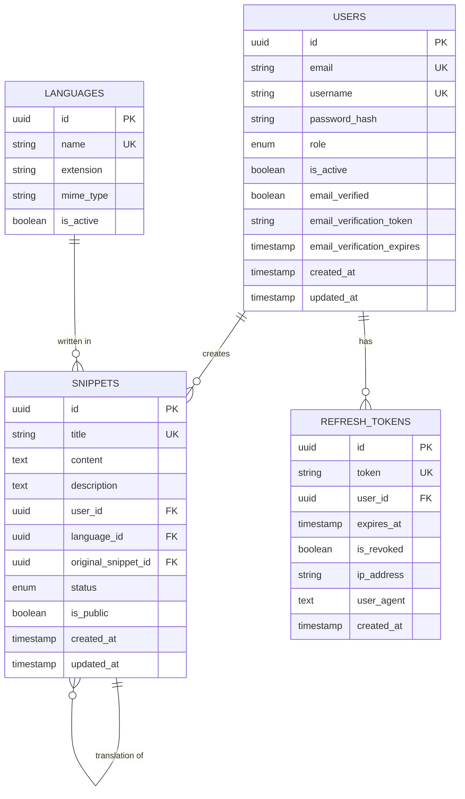
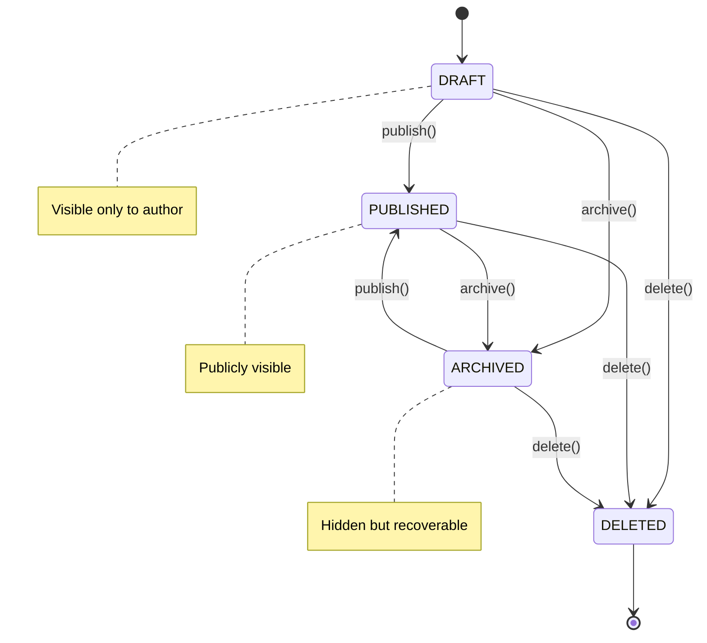

# 🚀 PolyglotCloud

**A modern platform for managing and sharing code snippets with post-quantum security.**

[](https://openjdk.java.net/)
[](https://spring.io/projects/spring-boot)
[](https://www.postgresql.org/)
[](LICENSE)

## 📖 Description

PolyglotCloud is a modern REST API developed with **Spring Boot 4** that allows developers to:

- 🔐 **Secure authentication** with JWT and refresh tokens
- 📝 **Code snippet management** in multiple programming languages
- 🔄 **Snippet translation** between different programming languages
- 🛡️ **Post-quantum security** with Argon2id + SHAKE-256
- 📧 **Automated email verification**
- 👥 **Role-based system** (USER, ADMIN)

## 🏗️ Architecture



## 🔐 Authentication Flow



## 🗂️ Snippet Management



## 🚀 Technologies

### Backend
- **Java 21** - Programming language
- **Spring Boot 4.0.1** - Main framework
- **Spring Security** - Authentication and authorization
- **PostgreSQL** - Primary database
- **Flyway** - Database migrations
- **MapStruct** - Object-to-object mapping
- **Lombok** - Boilerplate reduction

### Post-Quantum Security
- **Argon2id** - GPU-resistant password hashing
- **SHAKE-256** - Post-quantum hash function
- **BouncyCastle** - Cryptographic implementation
- **JWT** - Access tokens
- **HttpOnly Cookies** - Secure refresh token storage

### Communications
- **Spring Boot Mail** - Email sending
- **Thymeleaf** - HTML email templates
- **Mailtrap** - Email service for development

## 📊 Data Model



## 🛠️ Installation and Configuration

### Prerequisites
- Java 21
- PostgreSQL 16+
- Maven 3.8+

### 1. Clone the repository
```bash
git clone https://github.com/JesusLuna2309/polyglotCloud.git
cd polyglotCloud
```

### 2. Configure database
```sql
CREATE DATABASE polyglotcloud_db;
```

### 3. Configure environment variables
```yaml
# src/main/resources/application.yaml
spring:
  datasource:
    url: jdbc:postgresql://localhost:5432/polyglotcloud_db
    username: your_username
    password: your_password
  
  mail:
    host: sandbox.smtp.mailtrap.io
    port: 2525
    username: your_mailtrap_username
    password: your_mailtrap_password

app:
  jwt:
    secret: your-super-secret-jwt-key-here
    expiration: 86400
  email:
    from: noreply@polyglotcloud.com
    support-email: support@polyglotcloud.com
```

### 4. Run migrations
```bash
mvn flyway:migrate
```

### 5. Run the application
```bash
mvn spring-boot:run
```

## 📡 API Endpoints

### 🔐 Authentication
| Method | Endpoint | Description |
|--------|----------|-------------|
| `POST` | `/auth/register` | Register new user |
| `POST` | `/auth/login` | User login |
| `GET`  | `/auth/verify-email` | Verify email |
| `POST` | `/auth/refresh` | Refresh access token |
| `POST` | `/auth/logout` | User logout |

### 👥 Users
| Method | Endpoint | Description |
|--------|----------|-------------|
| `GET` | `/users` | List users (Admin only) |
| `GET` | `/users/{id}` | Get user profile |
| `PUT` | `/users/{id}` | Update profile |
| `PUT` | `/users/{id}/password` | Change password |

### 📝 Snippets
| Method | Endpoint | Description |
|--------|----------|-------------|
| `POST` | `/snippets` | Create snippet |
| `GET` | `/snippets` | List snippets |
| `GET` | `/snippets/{id}` | Get snippet |
| `PUT` | `/snippets/{id}` | Update snippet |
| `DELETE` | `/snippets/{id}` | Delete snippet |
| `POST` | `/snippets/{id}/translate` | Translate snippet |

## 🧪 Testing

```bash
# Run all tests
mvn test

# Run specific tests
mvn test -Dtest=AuthServiceTest

# Run tests with coverage
mvn jacoco:prepare-agent test jacoco:report
```

## 📈 Security Features

### 🛡️ Post-Quantum Cryptography
- **Argon2id**: Memory-intensive, brute-force attack resistant
- **SHAKE-256**: Extensible hash function resistant to quantum attacks
- **Timing Attack Protection**: Constant-time comparisons

### 🍪 Session Management
- **JWT Access Tokens**: Short-lived (15-30 min)
- **HttpOnly Refresh Tokens**: Stored in secure cookies
- **Token Rotation**: Automatic refresh token rotation
- **Device Tracking**: IP and User-Agent for auditing

### 🚨 Attack Protection
- **Rate Limiting**: Login attempt limitations
- **Account Locking**: Temporary lockout for failed attempts
- **CORS Configuration**: Cross-origin configuration
- **XSS Protection**: HttpOnly cookies, SameSite

## 🔄 Snippet States



## 🤝 Contributing

1. Fork the project
2. Create a feature branch (`git checkout -b feature/AmazingFeature`)
3. Commit your changes (`git commit -m 'Add some AmazingFeature'`)
4. Push to the branch (`git push origin feature/AmazingFeature`)
5. Open a Pull Request

## 📄 License

This project is under a **Proprietary License** based on MIT.

- ✅ **Personal and educational use**: Completely free
- ❌ **Commercial use**: Requires commercial license (contact author)

For commercial use, contact [@JesusLuna2309](https://github.com/JesusLuna2309). See the [LICENSE](LICENSE) file for more details.

## 👨‍💻 Author

**Jesús Luna** - [@JesusLuna2309](https://github.com/JesusLuna2309)

## 🙏 Acknowledgments

- Spring Boot Team for the excellent framework
- BouncyCastle for post-quantum implementations
- Mailtrap for development email service
- MapStruct for automatic object mapping

---

⭐ If this project was useful to you, don't forget to give it a star!