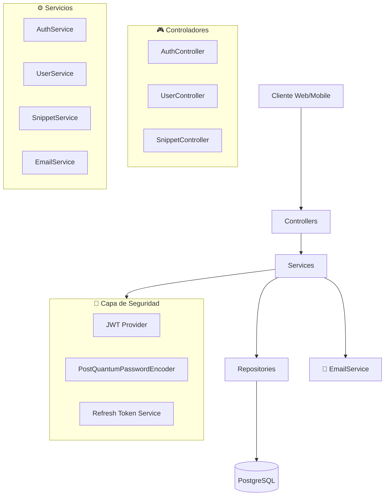
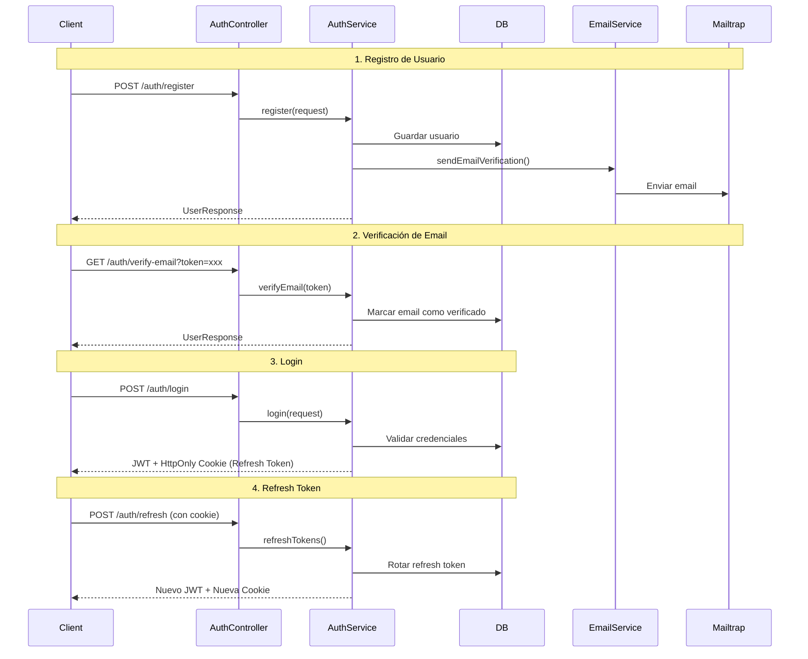
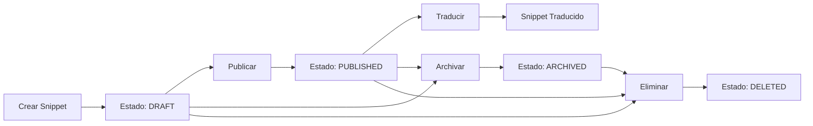
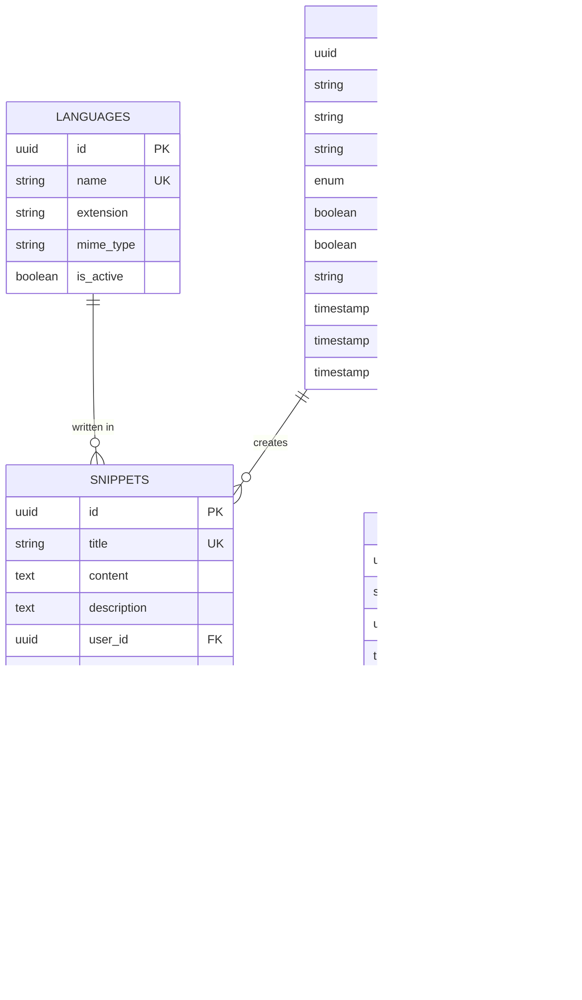
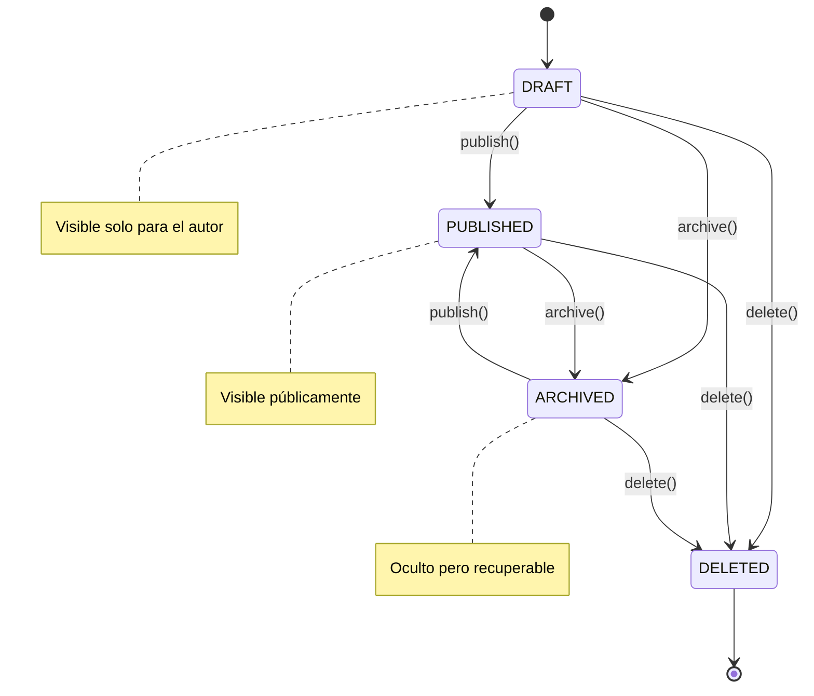

# 🚀 PolyglotCloud

**Una plataforma moderna para gestionar y compartir snippets de código con seguridad post-cuántica.**

[](https://openjdk.java.net/)
[](https://spring.io/projects/spring-boot)
[](https://www.postgresql.org/)
[](LICENSE)

## 📖 Descripción

PolyglotCloud es una API REST moderna desarrollada con **Spring Boot 4** que permite a los desarrolladores:

- 🔐 **Autenticación segura** con JWT y refresh tokens
- 📝 **Gestión de snippets** de código en múltiples lenguajes
- 🔄 **Traducción de snippets** entre diferentes lenguajes de programación
- 🛡️ **Seguridad post-cuántica** con Argon2id + SHAKE-256
- 📧 **Verificación de email** automatizada
- 👥 **Sistema de roles** (USER, ADMIN)

## 🏗️ Arquitectura



## 🔐 Flujo de Autenticación



## 🗂️ Gestión de Snippets



## 🚀 Tecnologías

### Backend
- **Java 21** - Lenguaje de programación
- **Spring Boot 4.0.1** - Framework principal
- **Spring Security** - Autenticación y autorización
- **PostgreSQL** - Base de datos principal
- **Flyway** - Migraciones de BD
- **MapStruct** - Mapeo objeto-objeto
- **Lombok** - Reducción de boilerplate

### Seguridad Post-Cuántica
- **Argon2id** - Hashing de passwords resistente a GPU
- **SHAKE-256** - Función hash post-cuántica
- **BouncyCastle** - Implementación criptográfica
- **JWT** - Tokens de acceso
- **HttpOnly Cookies** - Almacenamiento seguro de refresh tokens

### Comunicaciones
- **Spring Boot Mail** - Envío de emails
- **Thymeleaf** - Templates HTML para emails
- **Mailtrap** - Servicio de email para desarrollo

## 📊 Modelo de Datos



## 🛠️ Instalación y Configuración

### Prerrequisitos
- Java 21
- PostgreSQL 16+
- Maven 3.8+

### 1. Clonar el repositorio
```bash
git clone https://github.com/JesusLuna2309/polyglotCloud.git
cd polyglotCloud
```

### 2. Configurar base de datos
```sql
CREATE DATABASE polyglotcloud_db;
```

### 3. Configurar variables de entorno
```yaml
# src/main/resources/application.yaml
spring:
  datasource:
    url: jdbc:postgresql://localhost:5432/polyglotcloud_db
    username: your_username
    password: your_password
  
  mail:
    host: sandbox.smtp.mailtrap.io
    port: 2525
    username: your_mailtrap_username
    password: your_mailtrap_password

app:
  jwt:
    secret: your-super-secret-jwt-key-here
    expiration: 86400
  email:
    from: noreply@polyglotcloud.com
    support-email: support@polyglotcloud.com
```

### 4. Ejecutar migraciones
```bash
mvn flyway:migrate
```

### 5. Ejecutar la aplicación
```bash
mvn spring-boot:run
```

## 📡 API Endpoints

### 🔐 Autenticación
| Método | Endpoint | Descripción |
|--------|----------|-------------|
| `POST` | `/auth/register` | Registrar nuevo usuario |
| `POST` | `/auth/login` | Iniciar sesión |
| `GET`  | `/auth/verify-email` | Verificar email |
| `POST` | `/auth/refresh` | Renovar access token |
| `POST` | `/auth/logout` | Cerrar sesión |

### 👥 Usuarios
| Método | Endpoint | Descripción |
|--------|----------|-------------|
| `GET` | `/users` | Listar usuarios (Admin) |
| `GET` | `/users/{id}` | Obtener perfil de usuario |
| `PUT` | `/users/{id}` | Actualizar perfil |
| `PUT` | `/users/{id}/password` | Cambiar contraseña |

### 📝 Snippets
| Método | Endpoint | Descripción |
|--------|----------|-------------|
| `POST` | `/snippets` | Crear snippet |
| `GET` | `/snippets` | Listar snippets |
| `GET` | `/snippets/{id}` | Obtener snippet |
| `PUT` | `/snippets/{id}` | Actualizar snippet |
| `DELETE` | `/snippets/{id}` | Eliminar snippet |
| `POST` | `/snippets/{id}/translate` | Traducir snippet |

## 🧪 Testing

```bash
# Ejecutar todos los tests
mvn test

# Ejecutar tests específicos
mvn test -Dtest=AuthServiceTest

# Ejecutar tests con cobertura
mvn jacoco:prepare-agent test jacoco:report
```

## 📈 Características de Seguridad

### 🛡️ Criptografía Post-Cuántica
- **Argon2id**: Memoria intensiva, resistente a ataques de fuerza bruta
- **SHAKE-256**: Función hash extensible resistente a ataques cuánticos
- **Timing Attack Protection**: Comparaciones en tiempo constante

### 🍪 Gestión de Sesiones
- **JWT Access Tokens**: Vida corta (15-30 min)
- **HttpOnly Refresh Tokens**: Almacenados en cookies seguras
- **Token Rotation**: Rotación automática de refresh tokens
- **Device Tracking**: IP y User-Agent para auditoría

### 🚨 Protección contra Ataques
- **Rate Limiting**: Limitación de intentos de login
- **Account Locking**: Bloqueo temporal por intentos fallidos
- **CORS Configuration**: Configuración de origen cruzado
- **XSS Protection**: Cookies HttpOnly, SameSite

## 🔄 Estados de Snippets



## 🤝 Contribución

1. Fork del proyecto
2. Crear rama feature (`git checkout -b feature/AmazingFeature`)
3. Commit cambios (`git commit -m 'Add some AmazingFeature'`)
4. Push a la rama (`git push origin feature/AmazingFeature`)
5. Abrir Pull Request

## 📄 Licencia

Este proyecto está bajo la Licencia MIT. Ver el archivo [LICENSE](LICENSE) para más detalles.

## 👨‍💻 Autor

**Jesús Luna** - [@JesusLuna2309](https://github.com/JesusLuna2309)

## 🙏 Agradecimientos

- Spring Boot Team por el excelente framework
- BouncyCastle por las implementaciones post-cuánticas
- Mailtrap por el servicio de email para desarrollo
- MapStruct por el mapeo automático de objetos

---

⭐ Si este proyecto te fue útil, ¡no olvides darle una estrella!